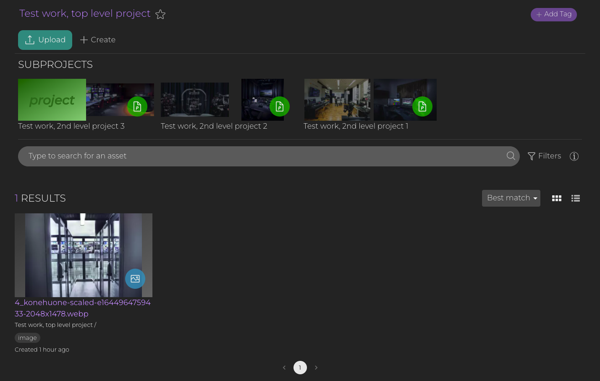

# TV Tools Oy - Software Developer recruitment coding task

# General overview of Media Pocket

Media Pocket is a digital asset management platform

- Users can create projects, and create and upload assets inside that project.
  - Optionally you can choose to create a more complex nested project hierarchy.

You can think of this `Project<->Asset` hierarchy similar to `Directory<->File` hierarchy on other file systems.

# Goal of the coding task

The goal of this coding task is to create a program that creates the following hierarchy in Media Pocket:

```bash
project/
  ├── asset
  ├── project
  │   ├── asset
  │   └── asset
  ├── project
  │   ├── asset
  │   └── asset
  ├── project
  │   ├── asset
  │   └── project
  │       ├── asset
  │       ├── asset
  │       └── asset
```
based on a given JSON structuce in `structure.json` by utilizing the Media Pocket API.

1. Create projects and assets following the structure mentioned above
2. Add media to assets

The final results should look something like this:




# How to get started

1. Login to [Media Pocket testwork environment](https://staging-testwork.devmediapocket.fi/) by the username and password we provided.
2. Create an API key from Media Pocket UI.

After this you can start utilizing the API with the help of our [API Documentation](https://staging-testwork.devmediapocket.fi/api/docs/V2.html)